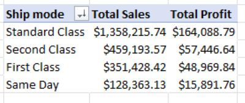
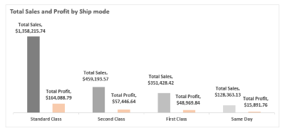

# Analysis of AG Superstore Sales Data

---

## Introduction

This analysis involves in-depth business scrutiny of the sales data of AG Superstore to showcase important insights which can help in maximizing profit and sales in general.  The Sales data contains attributes of almost 10,000 Sales orders such as Row ID,	Order ID,	Order Date,	Ship Date,	Ship Mode,	Customer ID,	Customer Name,	Segment,	Country,	City,	State,	Postal Code,	Region,	Product ID,	Category,	Sub-Category,	Product Name,	Sales,	Quantity,	Discount, and	Profit spread out into individual columns. 

Kindly feel free to interact with data (https://github.com/SeunA88/Analysis-of-AG-Superstore-Sales-Data/blob/main/Superstore%20data.csv)

Analysis of this data was carried out to acquire some useful insights from the dataset. Firstly, each column was formatted to depict the data therein. The following insights were then obtained from the data using various Excel functions:

1. In which state, Segment and category was the highest profit generated?
2. In which state, Segment and category was the highest sales generated?
3. What are the average sales and profit by categories?
4. What are the total quantities sold by categories and region?
5. What are the total sales and profit by region?
6. What are the total sales and profit by segment?
7. What are the total sales and profit by ship mode?

These acquired insights were further displayed with various visualization tools in Excel. Please find below each analysis alongside some visuals.

## Result of Analysis

-	In which state, Segment and category was the highest profit generated?

This was determined using the VLOOKUP function.

-	In which state, Segment and category was the highest sales generated?

This was determined using the VLOOKUP function

#### Analysis Insight for 1 and 2:  From the above analyses, it can be seen that highest profit was generated in Indiana state, in the Corporate segment and Technology category while the highest sale was generated in Florida, in Home office segment and Technology category. With this information, more resources can be channeled towards these areas to maximize their sales and profit potential. Noteworthy is the Technology category which not only brings in the highest sales but also the highest profit. Also of importance is the fact that the country and segment with the highest sales is not the same as those with the highest profit, hence, informed decisions can be made by stakeholders based on this surprising fact.
---

-	What are the average sales and profit by categories?

This was determined using the AVERAGE function in the pivot table "Value" field for each criteria/attribute, with the categories in the "Column" field. A Column chart was used to visualize the insight generated.

  

#### Analysis Insight: 

-	What are the total quantities sold by categories and region?

This was determined using the SUM function in the pivot table "Value" field for the total quantity sold, with the categories in the "Column" field and region in the "Row" field. A Column chart was used to visualize the insight generated.

 

#### Analysis Insight: 
---

- What are the total sales and profit by region? 

This was determined using the SUM function in the pivot table "Value" field for total sales and profit, with the region in the "Column" field. A Column chart was used to visualize the insight generated.

 

#### Analysis Insight: 
---

- What are the total sales and profit by segment?

This was determined using the SUM function in the pivot table "Value" field for total sales and profit, with the segment in the "Column" field. A Column chart was used to visualize the insight generated.

 

#### Analysis Insight: 
---

- What are the total sales and profit by ship mode?

This was determined using the SUM function in the pivot table "Value" field for total sales and profit, with the Ship mode in the "Column" field. A Column chart was used to visualize the insight generated.

 

#### Analysis Insight: 
---

## Conclusion
A clear understanding of the present state of health of AG Superstores have been made possible using analysis functions in Excel. Insights generated from these analyses can be chanelled towards promoting sales and making decisions for long term profit and sales maximization by stakeholders.
