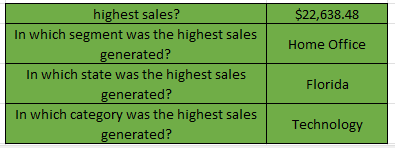

# Analysis of AG Superstore Sales Data

---

## Introduction

This analysis involves in-depth business scrutiny of the sales data of AG Superstore to showcase imprtant insights which can help in maximizing profit and sales in general.  It Sales data contains attributes of almost 10,000 Sales orders such as Row ID,	Order ID,	Order Date,	Ship Date,	Ship Mode,	Customer ID,	Customer Name,	Segment,	Country,	City,	State,	Postal Code,	Region,	Product ID,	Category,	Sub-Category,	Product Name,	Sales,	Quantity,	Discount, and	Profit spread out into individual columns. 

Kindly feel free to interact with data (https://github.com/SeunA88/Analysis-of-AG-Superstore-Sales-Data/blob/main/Superstore%20data.csv)

Analysis of this data was carried out to acquire some useful insights from the dataset. Firstly, each column was formatted to depict the data therein. The following insights were then obtained from the data using various Excel functions:
1. In which state, Segment and category was the highest profit generated?
2. In which state, Segment and category was the highest unit of goods sold?
3. What are the average sales and profit by categories?
4. What are the total quantities sold by categories and region?
5. What are the total sales and profit by region?
6. What are the total sales and profit by segment?
7. What are the total sales and profit by ship mode?

These acquired insights were further displayed with various visualization tools in Excel. Please find below each  analysis alongside some visuals.

## Result of Analysis

-	In which state, Segment and category was the highest profit generated?

This was determined using the VLOOKUP function

#### Analysis Insight: 
---

-	In which state, Segment and category was the highest unit of goods sold?

This was determined using the VLOOKUP function

#### Analysis Insight: 
---

-	What are the average sales and profit by categories?

This was determined using pivot table, with pivot fields functions AVERAGE in the value field and Categories in the column field.

#### Analysis Insight: 

-	What are the total quantities sold by categories and region?

This was determined using pivot table, with pivot fields functions SUM in the value field and Categories and region in the column and row feld respectively.

#### Analysis Insight: 
---

-	Number of Students who have diabetes and those who don’t.
This was determined using the SUM function on the sales column “=SUM(A2:A701)” for total revenue and “=SUM(L2:L701)” for total profit generated on the profit column.
Screenshot/visuals
Analysis Insight: 

Conclusion
Using pivot table and charts in Excel, insights have been generated from Medical Student Dataset of College of Medicine, YK and further insights can still be generated from the data, which will be useful for stakeholders to make informed decisions.
